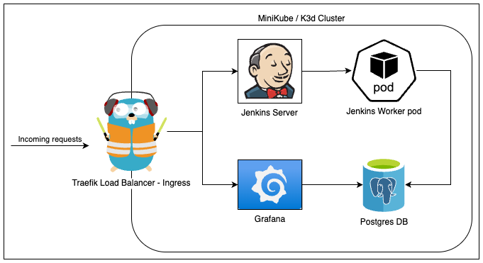

# ⚙️ Kubernetes DevOps Monitoring Stack

Local K3d environment with Jenkins, PostgreSQL, pgAdmin, and Grafana.



## 🚀 Quick Start

```bash
./main.sh install   # Deploy everything
./main.sh uninstall # Clean up
```

## 🔗 Service URLs

| **Service** | **URL** | **Purpose** |
|-------------|---------|-------------|
| **Jenkins** | http://jenkins.local | CI/CD Server |
| **pgAdmin** | http://pgadmin.local | Database Admin |
| **Grafana** | http://grafana.local | Monitoring Dashboard |
| **Traefik** | http://traefik.local | Ingress Dashboard |

## 🔐 Passwords

### pgAdmin
- **Email**: `admin@example.com`
- **Password**: `admin123!`

### PostgreSQL (for pgAdmin)
- **Username**: `postgres`
- **Password**: `admin123!`
- **Database**: `devops`

### Grafana
- **Username**: `admin`
- **Password**: 
```bash
kubectl get secret --namespace monitoring grafana -o jsonpath="{.data.admin-password}" | base64 --decode
```

## ℹ️ What It Does

- **Jenkins job** runs every 5 minutes inserting timestamps into PostgreSQL
- **pgAdmin** provides web interface to view database
- **Grafana** shows PostgreSQL performance metrics
- **All services** accessible via local domains (no port-forwarding)
